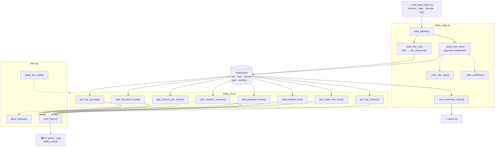
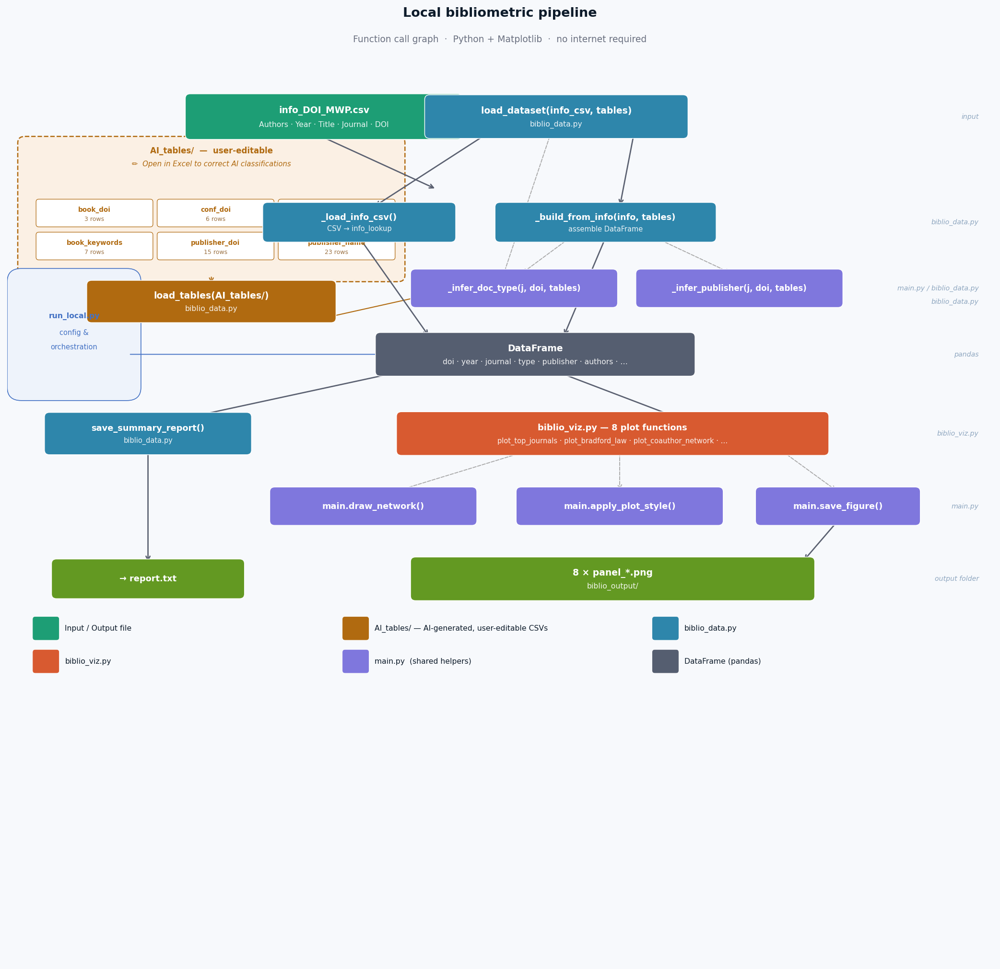

# Bibliometric Analysis — Local Pipeline

> Automatic bibliometric analysis from a CSV of DOIs.
> Produces 8 publication-ready figures and a synthesis report — **no internet required**.

---

## Contents

- [Overview](#overview)
- [File architecture](#file-architecture)
- [Pipeline flowchart](#pipeline-flowchart)
- [Function reference](#function-reference)
- [Installation](#installation)
- [Usage](#usage)
- [Configuration](#configuration)
- [AI-assisted iterative methodology](#ai-assisted-iterative-methodology)

---

## Overview

This pipeline reads a metadata CSV file (`info_DOI_MWP.csv`) and automatically generates
bibliometric figures and a synthesis text report.
It was developed for the study of wave propagation in pavements (DOI\_MWP corpus, ~140 articles)
but is entirely generic.

**Input :** `info_DOI_MWP.csv` — columns: `Authors`, `Year`, `Title`, `Journal / Conference`, `DOI`

**Outputs (in `biblio_output/`) :**

| File | Content |
|------|---------|
| `report.txt` | Synthesis report: period, document types, top journals/authors |
| `panel_top_journals.png` | Top 15 most-published journals / conferences |
| `panel_document_types.png` | Document type distribution (pie) |
| `panel_authors_per_article.png` | Co-authorship distribution |
| `panel_publisher_share.png` | Publisher breakdown (pie) |
| `panel_bradford_law.png` | Bradford concentration curve |
| `panel_types_over_time.png` | Document types by year (stacked bars) |
| `panel_coauthor_network.png` | Co-author collaboration network |
| `panel_top_authors.png` | Top 20 most-prolific authors |

---

## File architecture

```
main.py          ← shared utilities (imported by all modules)
biblio_data.py   ← data layer: reads CSV, infers type/publisher, builds DataFrame
biblio_viz.py    ← visualisation layer: 8 plot functions
run_local.py     ← runner: all configuration + calls to the above
```

**Dependency graph:**

```
run_local.py
    ├── import main          (style, save_figure, draw_network, resolve_output_dir)
    ├── import biblio_data   (load_dataset, save_summary_report)
    └── import biblio_viz    (plot_* functions)

biblio_data.py
    └── import main          (clean_doi, author_short_label, CSV_SEP, CSV_ENCODING)

biblio_viz.py
    └── import main          (PALETTE, draw_network, author_short_label)
```

> **Rule:** all configuration lives in `run_local.py` only.
> The three library files contain pure functions with no hardcoded paths or visual options.

---

## Pipeline flowchart

The flowchart below renders natively on GitHub.
The PNG version (`flowchart_local.png`) and its Python source (`flowchart_source.py`) are also included.





> Flowchart generated with **Python + Matplotlib** — source: `flowchart_source.py`

The pipeline has four stages:

1. **Input** — `info_DOI_MWP.csv` is read by `_load_info_csv()`.
2. **Build** — `_build_from_info()` assembles the DataFrame, calling `_infer_doc_type()` and `_infer_publisher()` for each row.
3. **Report** — `save_summary_report()` writes `report.txt`.
4. **Visualise** — each `plot_*` function receives `(df, ax, …)` and fills an Axes; `main.save_figure()` writes the PNG.

---

## Function reference

### `main.py` — shared utilities (261 lines)

| Function | Signature | Role |
|----------|-----------|------|
| `clean_doi` | `(raw: str) → str\|None` | Strips URL prefix, rejects placeholders, validates `10.<reg>/` pattern |
| `author_short_label` | `(full_name: str) → str` | `"Carret, Jean-Claude"` → `"J-C. Carret"` |
| `ISO2_NAMES` | `dict[str, str]` | ISO-2 code → full country name (65 entries) |
| `resolve_output_dir` | `(base: str) → str` | Creates output folder; if it exists, prompts to overwrite or number it |
| `apply_plot_style` | `(palette, font_family, font_size)` | Sets matplotlib/seaborn theme from `run_local.py` config |
| `save_figure` | `(fig, filename, output_dir, dpi)` | Saves PNG and closes figure |
| `draw_network` | `(G, ax, title, top_n, label_min_degree, label_fontsize)` | Shared NetworkX spring-layout renderer used by both viz modules |

---

### `biblio_data.py` — data layer (305 lines)

#### Public functions

| Function | Signature | Role |
|----------|-----------|------|
| `load_dataset` | `(info_csv: str) → pd.DataFrame` | Reads CSV → builds DataFrame. Raises `FileNotFoundError` / `ValueError`. |
| `save_summary_report` | `(df, output_dir: str)` | Writes `report.txt` — works with both local and API DataFrames |

#### Internal helpers

| Function | Role |
|----------|------|
| `_load_info_csv(filepath)` | Parses CSV rows into an `info_lookup` dict |
| `_build_from_info(info_lookup)` | Assembles DataFrame, calls `_infer_doc_type` + `_infer_publisher` per row |
| `_infer_doc_type(journal, doi)` | DOI-prefix first (authoritative), then venue name keywords |
| `_infer_publisher(journal, doi)` | Table-driven lookup: `_PUBLISHER_DOI` + `_PUBLISHER_NAME` |

**DataFrame columns produced by `load_dataset`:**

```
doi, year, journal, publisher, type, cited_by, references_n, authors, n_authors, title
```

**Document type inference — two-pass strategy:**

```
Pass 1 — DOI prefix (unambiguous)
    10.1007/978-*  10.1201/*    → book-chapter
    10.1051/e3s*   10.1088/*    → proceedings-article
    …

Pass 2 — Venue name keywords (fallback)
    "conference", "proceedings" → proceedings-article
    "lecture notes", "bookseries" → book-chapter
    Otherwise                   → journal-article
```

---

### `biblio_viz.py` — visualisation layer (192 lines)

All functions share the same pattern:
```python
plot_X(df: pd.DataFrame, ax: plt.Axes, [options]) → None
```
They fill an `ax` and use `main.PALETTE` (set by `apply_plot_style` in the run script).

| Function | Options | Output |
|----------|---------|--------|
| `plot_top_journals` | `n` | Horizontal bar chart — top *n* journals / conferences |
| `plot_document_types` | — | Pie chart — journal article / conference paper / book chapter |
| `plot_authors_per_article` | — | Bar chart — co-authorship size distribution |
| `plot_publisher_share` | `min_count`, `cmap` | Pie chart — publisher breakdown |
| `plot_bradford_law` | — | Bradford concentration curve (33 % / 66 % zones) |
| `plot_types_over_time` | — | Stacked bar chart — document types by year |
| `plot_coauthor_network` | `top_n`, `label_fontsize`, `label_min_degree` | Spring-layout co-author network |
| `plot_top_authors` | `n` | Horizontal bar chart — top *n* authors (identified by initials + family name) |

> **Note on author disambiguation:** authors are displayed as `"J-C. Carret"` rather than `"Carret"`,
> which prevents false merging of different people sharing a common surname (e.g. `"Li"`, `"Zhang"`).

---

### `run_local.py` — runner (139 lines)

`run_local.py` is the **only file to edit** for a new study.
It is divided into two zones:

```
CONFIGURATION (lines 1–65)   ← edit here
    ├── INFO_CSV, OUTPUT_DIR
    ├── PALETTE, FONT_FAMILY, FONT_SIZE, DPI
    ├── Chart parameters (TOP_JOURNALS_N, COAUTHOR_TOP_N …)
    ├── Colour maps (CMAP_PUBLISHERS)
    ├── Network label options (NETWORK_LABEL_SIZE, NETWORK_LABEL_MIN)
    ├── Figure sizes (FIGSIZE_*)
    └── Output filenames (FILE_*)

EXECUTION (lines 67–139)     ← do not edit
    ├── STEP 1 — load_dataset + save_summary_report
    └── STEP 2 — one block per figure (comment out to skip)
```

---

## Installation

```bash
git clone https://github.com/<your-username>/<your-repo>.git
cd <your-repo>
pip install pandas matplotlib seaborn networkx scipy
```

**Optional** (co-author network only):
```bash
pip install networkx   # already included above
```

Place your input file in the same folder:
```
info_DOI_MWP.csv
main.py
biblio_data.py
biblio_viz.py
run_local.py
```

---

## Usage

```bash
python run_local.py
```

If the output folder already exists, you are prompted:
```
  Output folder 'biblio_output' already exists.
  [1] Overwrite existing files
  [2] Create new folder  'biblio_output_1'
  Choice [1/2]:
```

Subsequent runs auto-number: `biblio_output_1`, `biblio_output_2`, …

---

## Configuration

All options are at the top of `run_local.py`.

### Colour palette

```python
PALETTE = {
    "primary"   : "#4472C4",   # main bars, strong network nodes
    "secondary" : "#2E86AB",   # secondary bars, medium nodes
    "accent"    : "#F4A261",   # trend lines, highlights
    "light"     : "#D6E8F5",   # weak nodes, background bars
    "dark"      : "#0D1B2A",   # text, labels
    "muted"     : "#8FA7C0",   # grid, network edges
    "bg"        : "#F7F9FC",   # figure background
}
```

### Adding a figure

1. Write `plot_my_chart(df, ax, ...)` in `biblio_viz.py`.
2. Add three lines in `run_local.py` STEP 2:

```python
fig, ax = plt.subplots(figsize=(10, 6))
bviz.plot_my_chart(df, ax, ...)
fig.tight_layout()
main.save_figure(fig, "my_chart.png", OUTPUT_DIR, DPI)
```

### Adapting the CSV format

Column names expected by `_load_info_csv` (in `biblio_data.py`):

| Column | Role |
|--------|------|
| `Authors` | Author list separated by ` and ` — e.g. `"Carret, J.-C. and Sauzéat, C."` |
| `Year` | Publication year (integer) |
| `Title` | Article title |
| `Journal / Conference` | Venue name — used to infer type and publisher |
| `DOI` | Raw DOI string — URLs like `https://doi.org/…` are accepted |

To use a different CSV, adapt column names in `_load_info_csv` or rename your CSV columns.

---

## AI-assisted iterative methodology

This project was built using an **AI-assisted iterative development loop**:

```
┌──────────────────────────────────────────────┐
│   1. Describe a requirement to the AI        │
│   2. AI generates code + explanation         │
│   3. Run tests locally                       │
│   4. AI documents changes in corrections.md  │
│      (dated session entries)                 │
│   5. Accept or request corrections → go to 1│
└──────────────────────────────────────────────┘
```

The file `corrections.md` acts as a **living change log** — each session is
dated and documents:
- what was changed and why
- the before/after code snippets
- the full test results

This approach keeps the code auditable even when generated by an AI,
because every modification is explicitly justified and tested.

### Tracked sessions in `corrections.md`

| Session | Theme |
|---------|-------|
| 1 | Initial refactoring — shared `draw_network`, `save_figure`, `resolve_output_dir` |
| 2 | Unused imports removed, deprecated Matplotlib API fixed |
| 3 | `print` → `save_summary_report` (no console output in libraries) |
| 4 | ISO-2 country name lookup corrected (`ISO2_NAMES` dict in `main.py`) |
| 5 | `biblio_data.py` — empty sections removed, inference functions optimised |

---

## Licence

MIT — free to use, adapt, and share.
