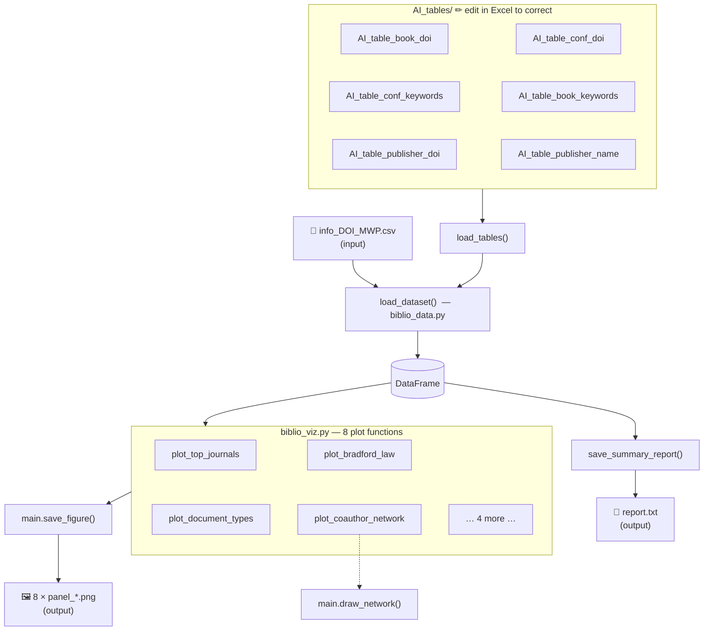

# Bibliometric Analysis — Local Pipeline

> A set of Python scripts that automatically read a list of scientific articles
> and generate charts describing who publishes them, where, and how often.
> **No internet connection required after installation.**

---

## Overview

**Bibliometrics** is the statistical analysis of scientific publications —
counting articles, mapping collaborations, identifying the most active
journals and authors.

This pipeline was developed for the study of **wave propagation in pavements**
(corpus DOI\_MWP, ~140 articles) but works for any subject area.

### What the program does

Given a spreadsheet of article metadata (authors, titles, journals, DOIs),
it automatically:

- classifies each article as a journal article, conference paper, or book chapter
- identifies the publisher from the DOI or journal name
- draws 8 publication-ready figures
- writes a concise text report

### Key features

| Feature | Detail |
|---------|--------|
| 🚫 No internet | Works entirely from your local CSV file |
| ✏️ Correctable | AI-generated classification tables are plain CSV files — fix errors in Excel |
| 🎨 Configurable | All colours, font sizes, and chart options are in one file (`run_local.py`) |
| 📋 Auditable | Every code change is recorded with date and reason in `corrections.md` |

### File architecture

```
main.py          shared utilities (used by the other files)
biblio_data.py   reads the CSV, classifies articles, writes report.txt
biblio_viz.py    draws the 8 figures
run_local.py     ← the only file you need to edit
AI_tables/       6 CSV files — AI-generated, open in Excel to correct
```

---

## Pipeline

The diagram below shows how data flows through the program.
([Graphviz](https://graphviz.org) source: `flowchart_local.dot`)




**In plain words:**

1. `run_local.py` reads your settings and starts everything.
2. The six `AI_tables/*.csv` files are loaded — they tell the program how to classify each article.
3. `info_DOI_MWP.csv` is read row by row. Each article gets a document type and a publisher name.
4. A text report is written to `report.txt`.
5. Each of the 8 plot functions draws one chart and saves a PNG.

---

## Input

You need one CSV file named `info_DOI_MWP.csv` with **exactly these column names**:

| Column | What to put there | Example |
|--------|-------------------|---------|
| `Authors` | Author names separated by ` and ` | `Carret, J.-C. and Sauzéat, C.` |
| `Year` | Publication year (number) | `2021` |
| `Title` | Article title | `Dynamic modulus of asphalt…` |
| `Journal / Conference` | Journal or conference name | `Road Materials and Pavement Design` |
| `DOI` | Digital Object Identifier | `10.1080/14680629.2020.1864481` |

> **Tip:** Export your Zotero / Mendeley / Web of Science collection as CSV
> and rename the columns to match the table above.

---

## Output

After running the script, a folder called `biblio_output/` is created with:

| File | Description |
|------|-------------|
| `report.txt` | Text summary: number of articles, coverage years, top journals, top authors |
| `panel_top_journals.png` | Which journals published the most articles? |
| `panel_document_types.png` | Journal articles vs. conference papers vs. book chapters |
| `panel_authors_per_article.png` | How many authors typically sign each article? |
| `panel_publisher_share.png` | Main publishers (Elsevier, Springer, MDPI…) |
| `panel_bradford_law.png` | Are publications concentrated in a few journals, or spread out? |
| `panel_types_over_time.png` | How the balance between article types evolved over the years |
| `panel_coauthor_network.png` | Which researchers have published together? |
| `panel_top_authors.png` | Most-published authors in the corpus |

---

## How to install

Place all files in the same folder:

```
my-project/
├── main.py
├── biblio_data.py
├── biblio_viz.py
├── run_local.py
├── info_DOI_MWP.csv        ← your data file
└── AI_tables/
    ├── AI_table_book_doi.csv
    ├── AI_table_conf_doi.csv
    ├── AI_table_conf_keywords.csv
    ├── AI_table_book_keywords.csv
    ├── AI_table_publisher_doi.csv
    └── AI_table_publisher_name.csv
```

Install the required packages (one-time):

```bash
pip install pandas matplotlib seaborn networkx
```

> **Not familiar with pip?** Open a terminal (Command Prompt on Windows, Terminal on Mac/Linux), paste the line above, and press Enter.

---

## How to run

```bash
python run_local.py
```

The script runs silently and saves everything in `biblio_output/`.

If you run it again with `biblio_output/` already existing:

```
  Output folder 'biblio_output' already exists.
  [1] Overwrite existing files
  [2] Create new folder  'biblio_output_1'
  Choice [1/2]:
```

Press `1` to overwrite, `2` to keep both results side by side.

---

## How to configure

All settings are at the top of `run_local.py` — **the only file you need to edit**.

```python
INFO_CSV   = "info_DOI_MWP.csv"   # path to your input file
OUTPUT_DIR = "biblio_output"       # where figures are saved
TABLES_DIR = "AI_tables"           # where the classification CSVs are

PALETTE = {
    "primary"  : "#4472C4",   # main colour — bars, strong network nodes
    "secondary": "#2E86AB",   # secondary colour
    "accent"   : "#F4A261",   # highlight — trend lines
    "bg"       : "#F7F9FC",   # figure background
    ...
}
FONT_SIZE       = 10    # base font size in points
DPI             = 150   # resolution (150 = screen, 300 = print)
TOP_JOURNALS_N  = 15    # how many journals to show in the ranking
TOP_AUTHORS_N   = 20    # how many authors to show
COAUTHOR_TOP_N  = 40    # how many nodes in the co-author network
```

---

## How to correct the AI classifications

The script decides automatically whether each article is a
**journal article**, **conference paper**, or **book chapter**,
and identifies the **publisher**, by looking up each article's
DOI and journal name in six small tables in `AI_tables/`.

> ⚠️ **These tables were generated by an AI and may contain errors.**
> Open them in Excel and correct any misclassifications before trusting the results.

| File | What it controls |
|------|-----------------|
| `AI_table_book_doi.csv` | DOI prefixes → book chapter |
| `AI_table_conf_doi.csv` | DOI prefixes → conference paper |
| `AI_table_conf_keywords.csv` | Journal name keywords → conference paper |
| `AI_table_book_keywords.csv` | Journal name keywords → book chapter |
| `AI_table_publisher_doi.csv` | DOI prefix → publisher name |
| `AI_table_publisher_name.csv` | Journal name keyword → publisher name |

**Correction workflow:**

1. Run the script → open `report.txt` → check the document type counts.
2. If a count looks wrong, open the relevant CSV in Excel, fix the row, save.
3. Re-run `python run_local.py` — the correction applies immediately.

---

## File descriptions

| File | Role | Edit? |
|------|------|-------|
| `run_local.py` | Runs everything — holds all settings | ✅ Yes |
| `biblio_data.py` | Reads the CSV, builds the dataset, writes `report.txt` | 🔧 Only to add features |
| `biblio_viz.py` | Draws the 8 figures | 🔧 Only to modify a chart |
| `main.py` | Shared tools used internally | ❌ No |
| `AI_tables/*.csv` | Classification tables | ✅ Yes — correct AI errors here |
| `corrections.md` | Development change log | 📖 Read only |
| `flowchart_local.png` | Visual diagram of the pipeline | 📖 Read only |
| `flowchart_local.dot` | Graphviz source of the diagram | 🔧 To regenerate the diagram |

---

## AI-assisted development methodology

This project was built using an iterative loop between a researcher and an AI:

```
  Describe a need  →  AI generates code  →  Run tests
         ↑                                       ↓
  Request corrections  ←  AI documents changes in corrections.md
```

Every modification is recorded in `corrections.md` with the date, reason,
before/after code, and test results — making the project fully auditable.

| Session | Theme |
|---------|-------|
| 1–2 | Architecture, unused imports, deprecated API |
| 3–4 | Silent libraries, country name corrections |
| 5–6 | Code cleanup, 15/15 tests pass |
| 7–8 | Classification tables moved to editable CSV files |
| 9–10 | Wrong DOI prefixes removed; tables renamed `AI_table_*` |
| 11 | Flowchart regenerated with Graphviz; README rewritten |

---

## Licence

RILEM TC MWP — free to use for all members of the TC group.
