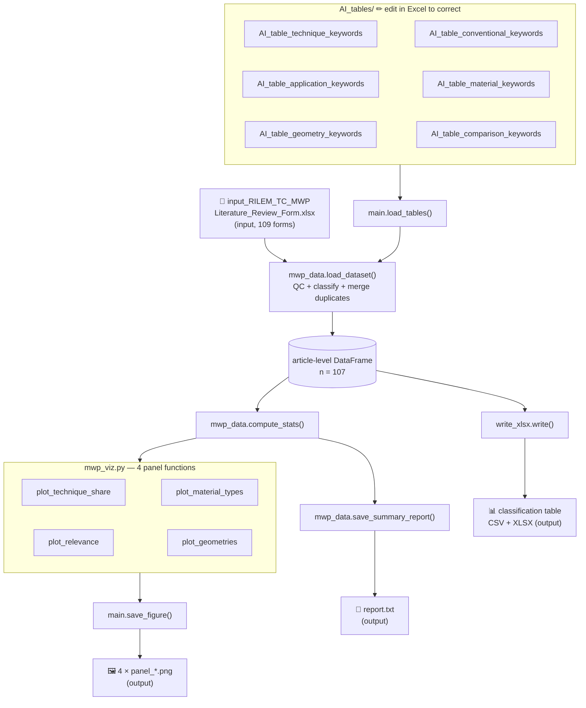

# UT / IRT Review-Form Analysis — Local Pipeline

> A set of Python scripts that automatically read the **RILEM TC MWP literature
> review forms** and generate the classification table and charts describing
> which mechanical-wave-propagation techniques are used, on which materials,
> and with what relevance for the TC.
> **No internet connection required after installation.**

Companion of the **Bibliometric Analysis — Local Pipeline** (corpus DOI_MWP)
of the same RILEM project: same architecture, same AI-tables correction
workflow, same auditability rules.

---

## Overview

The TC MWP literature review is collected through a Google Form
(one response = one reviewed article, up to 4 test blocks and 742 fields).
This pipeline turns that raw export into a statistical description of the
corpus, restricted to **Ultrasonic Testing (UT)** and **Impact Resonance
Testing (IRT)**.

**Golden rule:** only information contained in the review forms is used —
no original articles, no external sources.

### What the program does

Given the form export (`input_RILEM_TC_MWP__Literature_Review_Form.xlsx`),
it automatically:

- classifies each article: MWP technique (UT / IRT / both / neither),
  TC relevance, study-design category, application axis, test-methodology
  axis, data-analysis type
- merges duplicate reviews of the same article (union of labels,
  discordances flagged)
- draws 4 publication-ready figures
- writes a concise text report and a 4-sheet Excel deliverable

### Key features

| Feature | Detail |
|---------|--------|
| 🚫 No internet | Works entirely from your local xlsx file |
| ✏️ Correctable | AI-generated classification tables are plain CSV files — fix errors in Excel |
| 🎨 Configurable | All colours, font sizes, and options are in one file (`run_local.py`) |
| 📋 Auditable | Every code change is recorded with date and reason in `corrections.md` and `AI-journal_change.md`; every run writes `journal.log` |

### File architecture

```
main.py          shared utilities (used by the other files)
mwp_data.py      reads the xlsx, classifies articles, writes report.txt
mwp_viz.py       draws the 4 figures
write_xlsx.py    writes the formatted 4-sheet Excel deliverable
run_local.py     ← the only file you need to edit
AI_tables/       6 CSV files — AI-generated, open in Excel to correct
```

---

## Pipeline

The diagram below shows how data flows through the program.
([Graphviz](https://graphviz.org) source: `flowchart_mwp.dot`)




**In plain words:**

1. `run_local.py` reads your settings and starts everything.
2. The six `AI_tables/*.csv` files are loaded — they tell the program how to
   classify each article (technique families, materials, geometries…).
3. The form export is read row by row; each review form is classified, then
   duplicate reviews of the same article are merged (n = 107 articles).
4. A text report is written to `report.txt` and the classification table to
   CSV + a formatted 4-sheet Excel workbook.
5. Each of the 4 plot functions draws one chart and saves a PNG.

---

## Input

You need the Google-Forms export with **exactly the original header texts**
(the program locates columns by header prefix, so column order is free):

| Column (prefix) | What it contains | Used for |
|--------|-------------------|---------|
| `Article ID`, `Authors`, `Year`, `Title` | Article identification | table rows |
| `C2. What type of test is being reported? — Test 1…4` | UT / IRT / E* / Other | technique |
| `If "Other" was selected, specify the test name — Test 1…4` | free text | technique family |
| `B1. Material Type — Material 1…5` | materials studied | materials chart |
| `C3.2 Geometry — Test i — Specimen j` | specimen geometry | geometries chart |
| `Relevance for the laboratory characterization…` | High / Medium / Low | relevance chart |
| `Comparison between MWP tests and conventional tests` | agreement / bias / … | category |
| UT / IRT block fields (configuration, waves, boundary, modes, domain, method) | free text + choices | methodology + analysis axes |

---

## Output

After running the script, a folder called `mwp_output/` is created with:

| File | Description |
|------|-------------|
| `report.txt` | Text summary: n articles, coverage years, all distributions |
| `MWP_classification_table.csv` | One row per article, 8 classification columns |
| `MWP_UT_IRT_classification_table.xlsx` | 4 sheets: Classification table · Statistics (live % formulas) · Method notes · AI-journal_change |
| `panel_technique_share.png` | UT only / IRT only / both / neither (% of articles) |
| `panel_material_types.png` | Material types studied (% of articles, multi-label) |
| `panel_relevance.png` | High / Medium / Low relevance for TC MWP |
| `panel_geometries.png` | Specimen geometries in UT/IRT test blocks (multi-label) |
| `journal.log` | Timestamped run journal: QC findings + all statistics |

### Headline results (current corpus, n = 107, coverage 1995–2025)

UT only **68.2 %** · IRT only **25.2 %** · UT + IRT **0.9 %** (1 article) ·
neither **5.6 %** — HMA in **76.6 %** of articles — relevance High **36.4 %**
/ Medium 25.2 % / Low **34.6 %** — cylinders/cores in **62.1 %** of the 95
articles with UT/IRT specimen data. The oldest entry (1995, P88) was
verified as a legitimate form entry, not a typo.

---

## How to install

Place all files in the same folder:

```
my-project/
├── main.py
├── mwp_data.py
├── mwp_viz.py
├── write_xlsx.py
├── run_local.py
├── input_RILEM_TC_MWP__Literature_Review_Form.xlsx   ← your data file
└── AI_tables/
    ├── AI_table_technique_keywords.csv
    ├── AI_table_conventional_keywords.csv
    ├── AI_table_application_keywords.csv
    ├── AI_table_material_keywords.csv
    ├── AI_table_geometry_keywords.csv
    └── AI_table_comparison_keywords.csv
```

Install the required packages (one-time):

```bash
pip install pandas matplotlib openpyxl
```

---

## How to run

```bash
python run_local.py
```

The script prints its journal and saves everything in `mwp_output/`.

If you run it again with `mwp_output/` already existing:

```
  Output folder 'mwp_output' already exists.
  [1] Overwrite existing files
  [2] Create new folder  'mwp_output_1'
  Choice [1/2]:
```

(Non-interactive runs overwrite automatically.)

---

## How to configure

All settings are at the top of `run_local.py` — **the only file you need to edit**.

```python
INFO_XLSX  = ".../input_RILEM_TC_MWP__Literature_Review_Form.xlsx"
OUTPUT_DIR = "mwp_output"          # where figures are saved
TABLES_DIR = "AI_tables"           # where the classification CSVs are

PALETTE = {
    "primary"  : "#4472C4",   # main colour — UT slice, material bars
    "accent"   : "#F4A261",   # highlight — IRT slice, geometry bars
    "good"     : "#2ca02c",   # High relevance
    "bad"      : "#d62728",   # Low relevance
    "bg"       : "#F7F9FC",   # figure background
    ...
}
FONT_SIZE  = 10     # base font size in points
DPI        = 150    # resolution (150 = screen, 300 = print)
WRITE_XLSX = True   # also write the formatted 4-sheet workbook
```

---

## How to correct the AI classifications

The script classifies each article by matching form free text against six
small keyword tables in `AI_tables/`.

> ⚠️ **These tables were generated by an AI and may contain errors.**
> Open them in Excel and correct any misclassifications before trusting the results.

| File | What it controls |
|------|-----------------|
| `AI_table_technique_keywords.csv` | "Other" test names → UT-family / IRT-family |
| `AI_table_conventional_keywords.csv` | "Other" test names → conventional mechanical test |
| `AI_table_application_keywords.csv` | free text → application axis (stiffness / damage / QC) |
| `AI_table_material_keywords.csv` | material free text → normalized material (row order = priority) |
| `AI_table_geometry_keywords.csv` | geometry free text → normalized geometry (multi-label) |
| `AI_table_comparison_keywords.csv` | comparison field → "comparison assessed" |

**Correction workflow:**

1. Run the script → open `report.txt` → check the distribution counts.
2. If a count looks wrong, open the relevant CSV in Excel, fix the row, save.
3. Re-run `python run_local.py` — the correction applies immediately.

---

## File descriptions

| File | Role | Edit? |
|------|------|-------|
| `run_local.py` | Runs everything — holds all settings | ✅ Yes |
| `mwp_data.py` | Reads the xlsx, builds the dataset, writes `report.txt` | 🔧 Only to add features |
| `mwp_viz.py` | Draws the 4 figures | 🔧 Only to modify a chart |
| `write_xlsx.py` | Writes the formatted workbook | 🔧 Only to modify the deliverable |
| `main.py` | Shared tools used internally | ❌ No |
| `AI_tables/*.csv` | Classification tables | ✅ Yes — correct AI errors here |
| `corrections.md` | Development change log (per session) | 📖 Read only |
| `corrections_v2_archive.md` | Archived v2.0 data-quality audit (D1–D7, C1–C4, V1–V4) | 📖 Read only |
| `AI-journal_change.md` | Table of all AI modifications (also a workbook sheet) | 📖 Read only |
| `flowchart_mwp.png` | Visual diagram of the pipeline | 📖 Read only |
| `flowchart_mwp.dot` | Graphviz source of the diagram | 🔧 To regenerate the diagram |

---

## AI-assisted development methodology

This project was built using the same iterative loop as the DOI_MWP study:

```
  Describe a need  →  AI generates code  →  Run tests
         ↑                                       ↓
  Request corrections  ←  AI documents changes in corrections.md
                          + AI-journal_change table
```

Every modification is recorded with the date, reason, before/after and test
results — making the project fully auditable.

| Session | Theme |
|---------|-------|
| 1 | v1.0 — first extraction of the 742-field form; classification table + 4 charts; duplicate handling hot-fix |
| 2 | v2.0 — config/logic separation; QC stage; keyword-rule fix (P20 → HMA); staged pipeline; corrections.md + AI-journal_change |
| 3 | v3.0 — alignment on the DOI_MWP method: `main.py` / `mwp_data.py` / `mwp_viz.py` / `run_local.py` architecture; rules moved to 6 editable `AI_tables/*.csv`; `report.txt`; `panel_*` figures; overwrite prompt; Graphviz flowchart; README in this format. Statistics verified identical to v2.0 |

---

## Licence

RILEM TC MWP — free to use for all members of the TC group.
